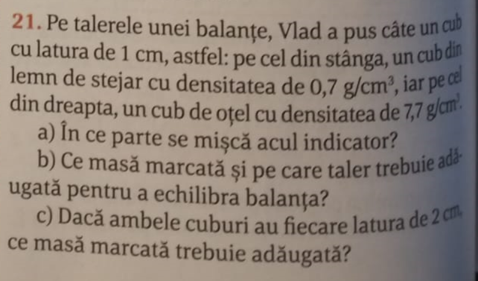

### Datele pb

- $l_1$ (latura primul cub) = 1 cm
- $l_2$ (latura al doilea cub) = 1 cm
- $\rho_1$ (densitate cub 1) = 0.7 g/ ${cm}^{3}$   
- $\rho_2$ (densitate cub 2) = 7.7 g/ ${cm}^{3}$  

### Se cere:
- In ce parte se misca acul indicator? (Care dintre cele 2 corpuri este mai greu)
- Ce masa marcata trebuie adaugata si pe care taler pentru a echilibra balanta? (diferenta de masa intre cele doua corpuri)
- Daca $l_1$ = $l_2$ ($l_1$ = 2 cm), ce masa marcata trebuie adaugata?

### Rezolvare:

#### Formule ajutatoare:
m = $\rho$ * V 

1. Transformare unitati de masura din datele problemei in S.I.
 $l_1$ = $l_2$ ($l_1$ = 0.01 m) (1 cm = 0.1 dm = 0.01 m)
 $\rho_1$  = 0.7 g/ ${cm}^{3}$   = 0.7 * $10^{-3}$  kg / ($10^{-6}$  $m^{3}$ ) = 0.7 * $10^{-3}$  * $10^{6}$  (kg/ $m^{3}$ ) = 700 (kg/ $m^{3}$ )
 $\rho_2$  = 7.7 * $10^{3}$ (kg/ $m^{3}$ ) = 7700 (kg/ $m^{3}$ )
 transformare ultimul subpunct ($l_1$ = $l_2$, $l_1$ = 0.02 m)

2. (prima intrebare)
 $m_1$  (masa corpului 1) ? $m_2$  (masa corpului 2) <=>
 $\rho_1$ * $V_1$  ? $\rho_2$ * $V_2$ 
 $l_1$ = $l_2$ 
 => $V_1$  = $V_2$ 
 ($V_1$  = $l_1$ $^{3}$, $V_2$  = $l_2$ $^{3}$ ... )
 $\rho_1$ ? $\rho_2$ 
 <=>
 700 (kg/ $m^{3}$ ) ? 7700 (kg/ $m^{3}$ )
=> $m_2$  > $m_1$ 
 (Raspuns prima intrebare: balanta se inclina spre corpul 2)

3. (a doua intrebare) Aflam masele celor doua corpuri
 $m_1$  = $\rho_1$  * $V_1$  = 700 (kg/ $m^{3}$ ) * (0.01) $^{3}$ $m^{3}$  = 700 (kg/  $\cancel{m^{3}}$ ) * ($10^{-2}$) $^{3}$ $\cancel{m^{3}}$ = 7 * $10^{2}$  * $10^{-6}$  kg
 $m_1$  = 7 * $10^{-4}$  kg
 $m_2$  = $\rho_2$  * $V_2$  = 7700 (kg/ $m^{3}$ ) * (0.01) $^{3}$ $m^{3}$  = 7700 (kg/  $\cancel{m^{3}}$ ) * ($10^{-2}$) $^{3}$  $\cancel{m^{3}}$  = 77 * $10^{2}$  * $10^{-6}$  kg
 $m_2$  = 77 * $10^{-4}$  kg
 (0.01 = $10^{-2}$  )
 Se cere |$m_1$  - $m_2$ | = $m_2$  - $m_1$  = 77 * $10^{-4}$  kg - 7 * $10^{-4}$  kg = $10^{-4}$  kg * (77 - 7) = 70 * $10^{-4}$  kg = 7 * $10^{-3}$  kg
 Se va adauga masa calculata pe talerul pe care este corpul $m_1$  pentru a echilibra balanta

4. (a treia intrebare) Aflam masele celor doua corpuri cu latura noua
 $m_1$' = $\rho_1$  * $V_1$' = 700 (kg/ $m^{3}$ ) * (0.02) $^{3}$ $m^{3}$  = 700 (kg/  $\cancel{m^{3}}$ ) * (2 * $10^{-2}$ ) $^{3}$  $\cancel{m^{3}}$  = 7 * $10^{2}$ * $2^{3}$ * $10^{-6}$ kg
 $m_1$' = 7 * 8 * $10^{-4}$  kg (= 56 * $10^{-4}$  kg)
 $m_2$' = $\rho_2$  * $V_2$' = 7700 (kg/ $m^{3}$ ) * (0.02) $^{3}$ $m^{3}$  = 7700 (kg/  $\cancel{m^{3}}$ ) * (2 * $10^{-2}$ ) $^{3}$  $\cancel{m^{3}}$  = 77 * $10^{2}$  * $2^{3}$  * $10^{-6}$  kg
 $m_2$ ' = 77 * 8 * $10^{-4}$  kg
 $m_2$ ' - $m_1$ ' = 77 * 8 * $10^{-4}$  kg - 7 * 8 * $10^{-4}$  kg = 8 * $10^{-4}$  kg * (77 - 7) = 70 * 8 * $10^{-4}$  kg = 56 * $10^{-3}$  kg
 (Masa nou calculata trebuie adaugata tot pe talerul cu corpul 1)

