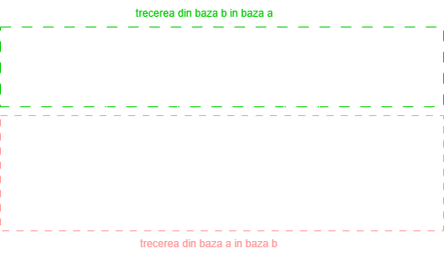

## Ce este un sistem de numeratie?

Un sistem de numeratie este o modalitate de reprezentare a numerelor. El ne ajuta sa masuram/contorizam/etc. o cantitate de ceva (kilograme, secunde, mere, etc.).

De exemplu putem spune despre **1** minut ca are **60** de secunde.

Cel mai cunoscut sistem de numeratie este cel in baza **10**.

## Cum functioneaza un sistem de numeratie?

Baza de numeratie a unui sistem de numeratie reprezinta numarul de simboluri pe care le avem la dispozitie ca sa numaram.

In baza 10 avem 10 simboluri (cifre) prin care formam numere (de la 0 la 9).

*Dar numerele se pot forma cu oricate simboluri pe care le putem defini.*
De exemplu putem numara in baza 6.

## Cum numaram intr-un alt sistem de numeratie decat cel in baz 10?

Mai intai stabilim in ce baza vrem sa numaram. In cazul de fata vom numara in baza 6.

Apoi trebuie sa vedem ce simboluri avem la dispozitie pentru a numara in baza 6. Natural vom considera cifrele de la 0 la 5. (Se pot defini orice alte simboluri, dar pentru usurinta calculului ne vom rezuma la acestea).

Acum ca avem ce ne trebuie, putem numara in baza 6 incepand de la 0:
`0, 1, 2, 3, 4, 5...?`

Cum formam urmatorul numar daca avem doar 6 cifre la dispozitie?

Raspunsul este simplu: ne imaginam ca ce am numarat anterior are ca si "cifra zecilor" cifra 0 (exact ca si cum am numara in baza 10)

Cum numaram in baza 10 `00, 01, 02, 03...` asa vom numara si acum:
`00, 01, 02, 03, 04, 05`

Acum pentru a trece la urmatorul numar, pentru cifra unitatilor nu mai avem cifre disponibile.

In sirul `00, 01, 02, 03...` (in baza 10) ajungem la `09` si punem urmatoarea cifra disponibila de dupa 0 pt cifra zecilor (adica 1) ajungem la urmatorul numar (adica `10`).

Exact acelasi principiu se aplica pt baza 6. Punem pt cifra zecilor urmatoarea cifra disponibila si la unitati o luam de la capat cu cifra 0:

00, 01, 02, 03, 04, 05, **1**0, **1**1, 12, 13, 14, 15, **2**0, **2**1, 22, 23, 24, 25...

## Cum trecem de la o baza de numeratie in alta?

Comparam sirurile de numere in baza 10 si in baza 6

`01, 02, 03, 04, 05, 06, 07, 08, 09, 10, 11, 12, 13, 14, 15` (baza 10)

`01, 02, 03, 04, 05, 10, 11, 12, 13, 14, 15, 20, 21, 22, 23` (baza 6)

Putem observa de exemplu ca `06` in baza 10 este echivalent cu a scrie `10` in baza 6 sau ca `15` in baza 6 este de fapt `11` in baza 10.

## Exista o metoda mai simpla de trecere decat cea pozitionala?

Sigur ca da, iar solutia nu este alta decat **teorema impartirii cu rest**.

Stim ca D : I = C rest R

D = deimpartit, I = Impartitor, C = Cat, R = Rest

Teorema se mai poate scrie: D = I * C + R (ne folosim de faptul ca restul este strict mai mi decat impartitorul <=> cifrele de la 0 la 5 sunt mai mici decat baza 6)

Exemplu: 10 : 6 = 1 rest 4 sau 10 = 6 * 1 + 4 (ceea ce este adevarat)

Cuma ajuta asta? Daca observam, restul 4 este cifra unitatilor din numarul `14` in baza 6 care este chiar `10` in baza 10.

Daca luam catul (adica `1`) si il mai impartim odata la 6:

1 : 4 = 0 rest 1 sau 1 = 4 * 0 + 1 

restul 1 este cifra zecilor din acelasi numar `14`.

Astfel am compus echivalentul numarului `10` din baza 10 in baza 6.

Ne oprim cu impartitul cand am ajuns la ultimul cat sa fie 0.

Atat de simplu!

Daca avem un numar mai mare (de exemplu 40) in baza 10 si vrem sa vedem cum arata in baza 6, se aplica acelasi algoritm
```
40 : 6 = 6 rest 4 (4 este prima cifra din numar incepand cu cifra unitatilor)

Luam catul obtinut si il impartim iar:

6 : 6 = 1 rest 0 (0 este a doua cifra => cifra zecilor in baza 6)

Luam ultimul cat obtinut si il impartim:

1 : 6 = 0 rest 1 (1 este a treia cifra => cifra sutelor in baza 6)

Ne oprim pentru ca am ajuns la catul 0

Acum compunem numarul: `104` => 40 in baza 10 este 104 in baza 6
```

## Ce facem daca avem un numar in baza x si vrem sa vedem cum se scrie in baza 10?

Aici ne folosim de puterile bazei de numeratie pe care am ales-o (6).

Cum il putem scrie pe `40` ca 4 * $10^1$ + 0 * $10^0$ asa il putem scrie si pe `104` in functie de puterile lui 6

`104` (in baza 6) = 1 * $6^2$ + 0 * $6^1$ + 4 * $6^0$ = 36 + 0 + 4 = 40 (in baza 10)

Alt exemplu: Avem numarul 534 in baza 7 si vrem sa stim cat este el in baza 10:

534 in baza 7 = 5 * $7^2$ + 3 * $7^1$ + 4 * $7^0$ = 5 * 49 + 3 * 7 + 4 * 1 = 245 + 21 + 4 = 270 in baza 10

Disclaimer:

$baza^0$ => "cifra unitatilor" in baza respectiva

$baza^1$ => "cifra zecilor"

$baza^2$ => "cifra sutelor"

## Problema: Ce se intampla daca avem numere fractionare (cu virgula)?

Cum aflam de exemplu cat este numarul 4,5 din baza 10 scris in baza 6?

Aici descompunem numarul 4,5 in parte intreaga si parte fractionara: `4,5 = 4 + 0,5`

Apoi luam partea intraga si aplicam acelasi algoritm: `4 : 6 = 0 rest 4` (ne oprim pt ca am ajuns la cat 0)

Apoi (plot twist) luam partea fractionara si o inmultim cu baza pana obtinem un numar intreg (sau pana cand precizia numarului este suficienta): `0,5 * 6 = 3,0` (3 va fi primul numar de dupa virgula => vom adauga 0,3 la rezultat)

Asadar obtinem numarul 4,3 in baza 6.

Cum verificam? Incercam sa il scriem pe 4,3 dupa puterile lui 6

4,3 = 4 * $6^0$ + 3* $6^{-1}$ = 4 * 1 + 3 * 1/6 = 4 + 0,5 = 4,5 in baza 10 (asta fiind trecerea din baza 6 in baza 10)

Alt exemplu: avem numarul 8,231 in baza 10 si vrem sa-l trecem in baza 9.

8,231 = 8 + 0,231

8 : 9 = 0 rest 8

0,231 * 9 = **2**,079 (1 prima cifra dupa virgula)

Descompunem iar in parte intreaga si fractionara

0,079 * 9 = **0**,711

0,711 * 9 = **6**,399 etc.

Aici luam partile intregi din rezultate si le punem in ordinea pe care le-am obtinut dupa virgula

=> 8,231 in baza 10 = 8,206.. in baza 9

Schema generala de conversie: Orice numar se poate scrie ca o suma de puteri a bazei de numeratie in care se reprezinta

