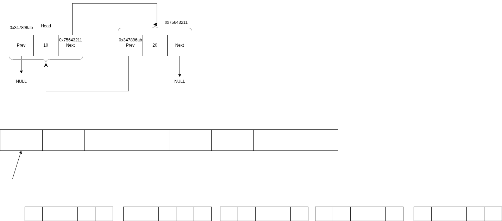

## Recapitulare

### Lista dublu inlantuita: 
- spre deosebire de lista simplu inlantuita, are 2 refernite, catre urmatorul element si catre precedentul
- pentru a putea lucra ca ea, ne trebuie cel putin o referinta (ori catre capul listei, ori si catre coada listei)

### Functii
- cand se transmite un paramentru, se face o copie a acelei valori => pentru a putea lucra cu valorile dinainte de apelul functiei, trebuie transmisa ADRESA acelei valori (referinta)
- functia `exit()` iese din program inainte de a se termina `natural`

### Operatorul tertiar
- `conditie ? instr. daca TRUE : instr. daca FALSE`

### Referentiere

``` 
int x = 5;
```
- x este tinut in memorie la o anumita adresa (eticheta a unei zone de memorie) pe care o putem citi/accesa cu `&x`
- 5 etse valoarea efectiva stocata la acea adresa
- pentru a putea lucra direct cu eticheta de memorie, putem declara in program:
```
int* x; // x ne asteptam sa stocheze o adresa unde putem avea o valoare de tip int
Node* node; // node ne asteptam sa stocheze o adresa unde putem avea o valoare de tip Node
Node node1 = *node; // node1 este valoarea efectiva stocata la adresa continuta in node 
Node*** node2;
```

Analogie: pentru un element dintr-o lista inlantuita avem adresa la care este stocat acel element, adresa care poate fi valoare de prev sau next pentru elementele adiacente din lista.


### Vectori

```
int v[5]; (alocat static, are adresa) <=> int* v = malloc(5*sizeof(int)) (alocat dinamic, are adresa)
int m[5][5]; <=> int** m = malloc(5*sizeof(int*)), for... 
&v[0] <=> v
```

### Fisiere Header

- permit separarea utilizarii de functii de implementarea lor, pentru a permite mai multor programe sa foloseasca aceeasi implementare.

### Variabile globale vs. locale

## Ce am lucrat
- Labul1
    - lista dublu inlantuita
    - stiva
- Labul 2
    - in `implementare.c` ai implementarea operatiilor pentru lista dublu inlantuita pe care le poti folosi la tabela de dispersie cu adresare deschisa
- Mers mai departe pana la labul 6 inclusiv (optional)

