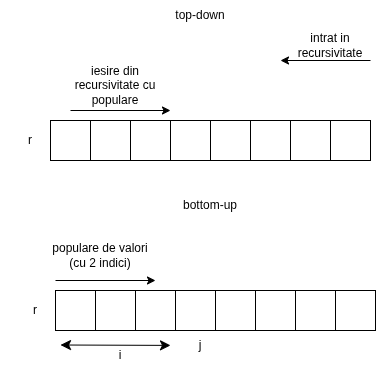
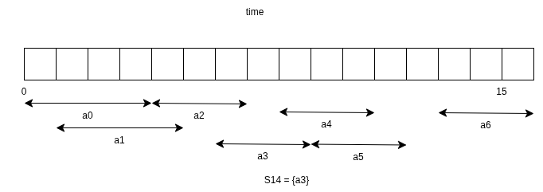

# Programare dinamica

desen - aboradare top-down vs bottom-up

desen - activitati

Prin PD includem solutiile optime de program de activitati in problema noastra initiala, in intervalul orar care ne intereseaza.

In abordarea Greedy, mergem din aproape in aproape (incepand de la primul element gasit, vedem ce merge cu el)

Backtracking - spart de parole neoptimizat (exemplu)

spatiul (ce se poate pune in parola): {0,1,2,3,4,5,6,7,8,9}

parola este din 4 cifre

0000
0001
0002
....
0009
0010
0011
0012
....

cand nu mergem in directia buna, ne dam un pas in spate si incercam cu alte solutii.
