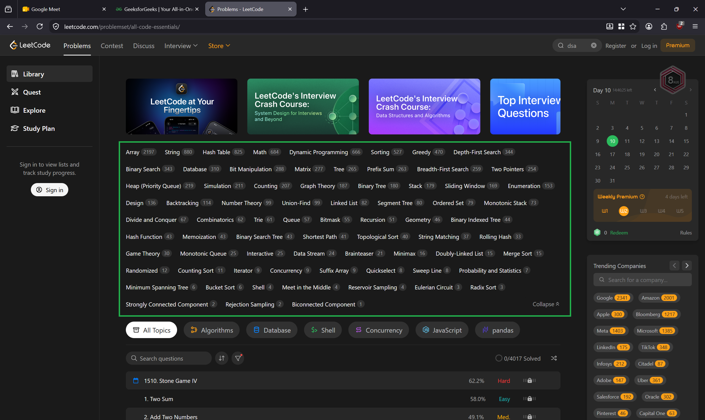

## 27 iulie 2026

### Pentru a instala WSL

Din Command Prompt comanda `wsl` + cele 2 comenzi recomandate, la a doua cu distributia dorita unde scrie `<Distro>` (Ubuntu)

### Pentru a deschide VS Code din WSL

1. De la Start -> scrii `WSL` -> Open
2. Din linia de comanda scrii `code .` pentru a edita in VS Code
3. Terminal -> New Terminal -> + Down Arrow -> Ubuntu

### Instalarea de gcc (din WSL):

1. `sudo apt update`
2. `sudo apt install gcc`
3. `sudo apt update`

### Lucrul cu cod C in VS Code + WSL

5. In VS Code: Creezi un fisier cu extensia .c
6. Il editezi + salvezi
7. In WSL:
   - WSL-ul sa fie in folderul in care este si codul .c
   - `gcc <nume_fisier>.c -o <nume_program>`
   - `./<nume_program>`

- Mergem prin cursuri
- 2 ore per sedinta, ramas lunea de la 17:00

- Comenzi in WSL: `cd, ls, man`
- Shift + ALt + Down Arrow - dubleaza linia curenta
- Alt+Z - fara scroll orizontal

## 3 august

- ~~Referinte in memorie~~
- ~~Liste inlantuite~~
- ~~Vectori~~
- ~~Recursivitate~~
- ~~Functii~~
- ~~Antet de functie~~

## 10 august

- ~~operatii de siruri (in paralel pe liste simplu inlantuite si pe vectori alocati dinamic)~~
- ~~stive/cozi~~
- ~~tabele de dispersie~~
- ramane pe ora 10 pe Meet
- site-uri pentru practice:
   - [W3Schools](https://www.w3schools.com/dsa/dsa_intro.php) (teorie)
   - [GeeksForGeeks](https://www.geeksforgeeks.org/dsa/dsa-tutorial-learn-data-structures-and-algorithms/) (teorie)
   - [Leetcode](https://leetcode.com/problemset/all-code-essentials/) (practice)
   - [PbInfo Liste](https://www.pbinfo.ro/?pagina=itemi-evaluare-lista&disciplina=0&clasa=10&tag=110&subtag=111&eticheta=0) (practice)

## 17 august 2026
- tabele de dispersie + stive + cozi - practice
- abori