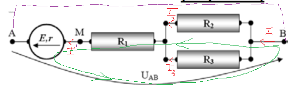

## Subiectul 1

1. d)
2. a)
3. $I * \Delta t = \frac{\Delta q}{\Delta t} * \Delta t = \Delta q$

$U = \frac{L}{q} => q = \frac{L}{U} => J/V (b)$

4. $E_{pralel} = E = 12V$

$r_{paralel} = \frac{r}{3} = 1\Omega$ (c)

5. $R_0 = \rho_0*\frac{l}{S}, R = \rho * \frac{l}{S}$

$\rho = \rho_0(1 + \alpha*\Delta t)$ =>

$R * \cancel{\frac{S}{l}} = R_0 * \cancel{\frac{S}{l}}(1 + \alpha*\Delta t) => \Delta t = \frac{\frac{R}{R_0} - 1}{\alpha} = \frac{\frac{120\Omega}{37.5\Omega} - 1}{10^{-3}grad^{-1}} = 2200 $ &deg;C(d)

$P = U * I = U * \frac{U}{R} = \frac{U^2}{R} => R = \frac{U^2}{P} = \frac{3600V^2}{30W} = 120\Omega$

## Subiectul 2

E = 4.5V, $r = 1\Omega, R_1 = 2\Omega, R_2 = 6\Omega, R_3 = 3\Omega$

### a) $R_{MB} = ?$

$\frac{1}{R_p} = \frac{1}{R_2} + \frac{1}{R_3} => r_p = \frac{1}{\frac{1}{R_2} + \frac{1}{R_3}} = \frac{1}{\frac{1}{6\Omega} + \frac{1}{3\Omega}} = 2\Omega$
=> $R_e = R_1 + R_p = 4\Omega$

### b) $I_{R_{2}} = ?, t = 10 s$

t = 10 s => $U_{AB} = 19.5V$

KIRCHHOFF (II): $E = I (R_e + r) + U_{AB} => I = \frac{E - U_{AB}}{R_e + r} = \frac{4.5V - 19.5V}{5\Omega} = -3A$

$U_p = I * R_p = I_2 * R_2 => I_2 = I * R_p / R_2 = 3A * 2\Omega / 6 \Omega = 1A$

### c) t = ?, $I_{R_1} = 0$
=> E = $U'_{AB} = 4.5V$

$\frac{19.5V}{10s} = \frac{4.5V}{x} => x = \frac{45}{19.5}s =2.3s$

### d) I' cu fir intre A si B

Nu se poate tine cont de tensiunea variabila (nu ni se da un t de considerat)

$I' = \frac{E}{R_e + r} = \frac{4.5V}{4 \Omega + 1\Omega} = 0.9A$

