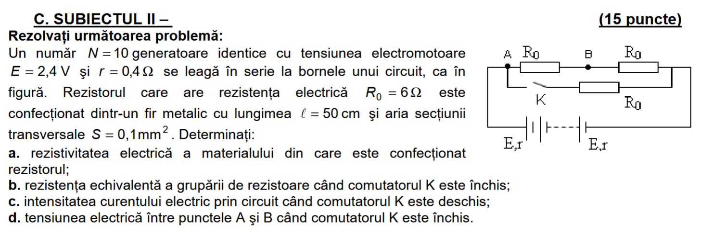

# Subiectul 1

### 1.
3.5 kWh in J = ?

1 kWh = 36 * $10^5$ J => 3.5 kWh = 3.5 * 36 * $10^5$ J = 126 * $10^5$ J = 12.6 * $10^6$ J (d)

### 2.
$\frac {U} {R} * \Delta t = \frac {I * \cancel R} {\cancel R} * \Delta t = I * \Delta t$

q = I * $\Delta t$

E = U * q = U * I * $\Delta t$

=> $I * \Delta t = \frac {E (J)} {U (V)}$ (c)

### 3.
$\frac {l_1} {l_2} = 4$, $\frac {d_1} {d_2} = 2$, $\frac {R_1} {R_2} = ?$

R = $\rho * \frac {l} {S}$

S = $\pi * r^2$

d = 2 * r => r = $\frac {d} {2}$

$S_1 = \pi * r_1^2$, 
$S_2 = \pi * r_2^2$

$\frac {R_1} {R_2}$ = $\frac {\cancel \rho * \frac {l_1}{S_1}} {\cancel \rho * \frac{l_2}{S_2}}$ = $\frac {l_1} {S_1} * \frac {S_2} {l_2}$ = $\frac {l_1} {l_2} * \frac {S_2} {S_1}$ = $\frac {l_1} {l_2} * \frac {S_2} {S_1}$ = $\frac {l_1} {l_2} * \frac {\cancel \pi * r_2^2} {\cancel \pi * r_1^2}$ = $\frac {l_1} {l_2} * \frac {(\frac {d_2} {\cancel 2})^2} {(\frac {d_1} {\cancel 2})^2}$ = $\frac {l_1} {l_2} * (\frac {d_2} {d_1})^2$ = 4 * $(\frac {1} {2})^2$ = 1 (c)

### 4.
$R_e$ serie = $\Sigma R_i$ (a)

### 5. 

E = 100V

r = 10 $\Omega$

I = 2 A

R = ?

E = U + u = I * R + I * r = I * (R + r) => $R + r = \frac {E} {I} => R = \frac {E} {I} - r = \frac {100V} {2A} - 10 \Omega = 50 \Omega - 10 \Omega = 40 \Omega$ (d)

# Subiectul 2

### a) 
$R_0 = \rho * \frac {l} {S}$

l = 5 * $10^{-1}$ m

S = 0.1 * $(10^{-3} m)^2$ = 0.1 * $10^{-6} m^2$ = $10^{-7} m^2$

$\rho = R_0 * \frac {S} {l} = 6 \Omega * \frac {10^{-7} m^2} {5 * 10^{-1} m} = \frac {6} {5} * 10 ^ {-6} \Omega$ * m

### b)
$R_{serie} = 2 * R_0 = 2 * 6 \Omega = 12 \Omega$

$\frac {1} {R} = \frac {1} {R_{serie}} + \frac {1} {R_{02}} => R_e = \frac {1} {\frac {1} {R_{serie}} + \frac {1} {R_{02}}} = \frac {1} {\frac {1} {12 \Omega} + \frac {1} {6 \Omega}} = 4 \Omega $ 

### c)
$E_{total} = U_{total} + u_{total}$

$N * E = I * R_{serie} + I * N * r = I * (R_{serie} + N * r) $

=> 
$I = \frac {N * E} {R_{serie} + N * r} = \frac {10 * 2.4 V} {12 \Omega + 10 * 0.4 \Omega} $ = 1.5 A

### d)
$N * E = I' * N * r + I' * R_e$

$I' = \frac {N * E} {N * r + R_e} = \frac {24 V} {8 \Omega} = 3 A$

$I' = I_1 + I_2$

$U_{total} = I' * R = I_1 * R_{serie} = I_2 * R_{02} $

$I_2 = I' - I_1$

$I_1 * R_{serie} = (I' - I_1) * R_{02}$

$I_1 * R_{serie} = I' * R_{02} - I_1 * R_{02}$

$I_1 * (R_{serie} + R_{02}) = I' * R_{02} $

$I_1 = \frac {I' * R_{02}} {R_{serie} + R_{02}} = \frac {3A * 6 \Omega} {12 \Omega + 6 \Omega} = 1A $

$U_{ab} = I_1 * R_0 = 1A * 6 \Omega = 6V$

