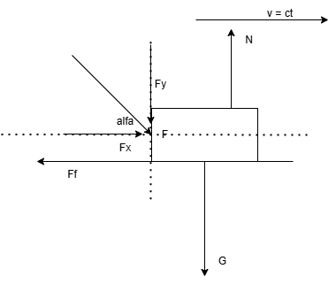
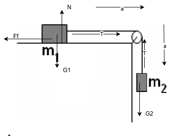
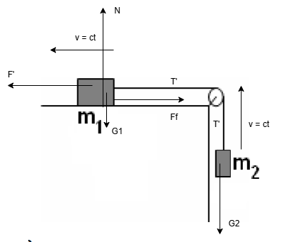

## Subiectul 1

1. d)
2. $P = \frac{L}{\Delta t} = \frac{F * d}{\Delta t} = \frac{m * a * d}{\Delta t}  = \frac{kg * \frac{m}{s^2} * m}{s} = \frac{kg * m^2}{s^3}$ (b))
3. a)
4. 

Vectiorial:

Ox: $\vec{F_x} + \vec{F_f} = \vec{0}$

Oy: $\vec{F_y} + \vec{G} + \vec{N}= \vec{0}$

Scalar:

Ox: $F_x - F_f = 0$

Oy: $F_y + G - N = \vec{0}$

=>

Ox: $F_x = F_f => F cos(\alpha) = \mu * N$

Oy: $F_y + G - N = \vec{0} => F sin(\alpha) + m * g = N$

=> $F cos(\alpha) = \mu * (F sin(\alpha) + m * g) => \mu = \frac{F cos(\alpha)}{F sin(\alpha) + m * g}$ (d))

5. F = ?

$m = 0.3 kg, \Delta t = 2 s, \Delta v = 6 m/s (a = \frac{\Delta v}{\Delta t}, F = m * a) => F = m * \frac{\Delta v}{\Delta t} = 0.3 kg * \frac{6 m/s}{2 s} = 0.9 N$ (c))

## Subiectul 2

## Datele problemei

$m_1 = 200 g = 0.2 kg$

$m_2 = 100 g = 0.1 kg$

$\mu = 0.2$

Sistemul **initial** in repaus

### a) a = ?

Vectorial

m1: Ox: $\vec{T} + \vec{F_f} = m_1 * \vec{a}$

m1: Oy: $\vec{G_1} + \vec{N} = \vec{0}$

m2: Oy: $\vec{G_2} + \vec{T} = m_2 * \vec{a}$

Scalar:

m1: Ox: $T - F_f = m_1 * a$

m1: Oy: $G_1 - N = 0$

m2: Oy: $G_2 - T = m_2 * a$

=> $m_2 * g - \mu * N = (m_1 + m_2) * a => a = \frac{m_2 * g - \mu * m_1 * g}{m_1 + m_2} = \frac{0.1 kg * 10 N/kg - 0.2 * 0.2 kg * 10 N/kg}{0.3 kg} = \frac{1 N - 0.4 N}{0.3 kg} = 2 m/s^2$

### b) T = ?

m1: Ox: $T - F_f = m_1 * a (F_f = \mu * N = \mu * m_1 * g) => T = m_1 * a + \mu * m_1 * g = 0.2 kg * 2 m/s^2 + 0.2 * 0.2 kg * 10 N / kg = 0.4 N + 0.4 N = 0.8 N $

sau barem :)))

### c) $\Delta t = ?  a.i. v = 4m/s$

Legea vitezei: $v = v_0 + a * \Delta t => \Delta t = \frac{v - v_0}{a} = \frac{4 m/s}{2m/s^2} = 2 s$

### d) F' = ?

Vectorial

m1: Ox: $\vec{F'} + \vec{F_f} + \vec{T'} = \vec{0}$

m1: Oy: $\vec{G_1} + \vec{N} = \vec{0}$

m2: Oy: $\vec{T'} + \vec{G_2} = \vec{0}$

Scalar:

m1: Ox: $F' - F_f - T' = 0$

m1: Oy: $G_1 - N = 0$

m2: Oy: $T' - G_2 = 0$

=> $F' = F_f + T' = \mu * m_1 * g + m_2 * g = 0.4 N + 1 N = 1.4 N$
