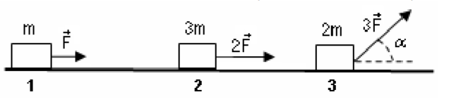
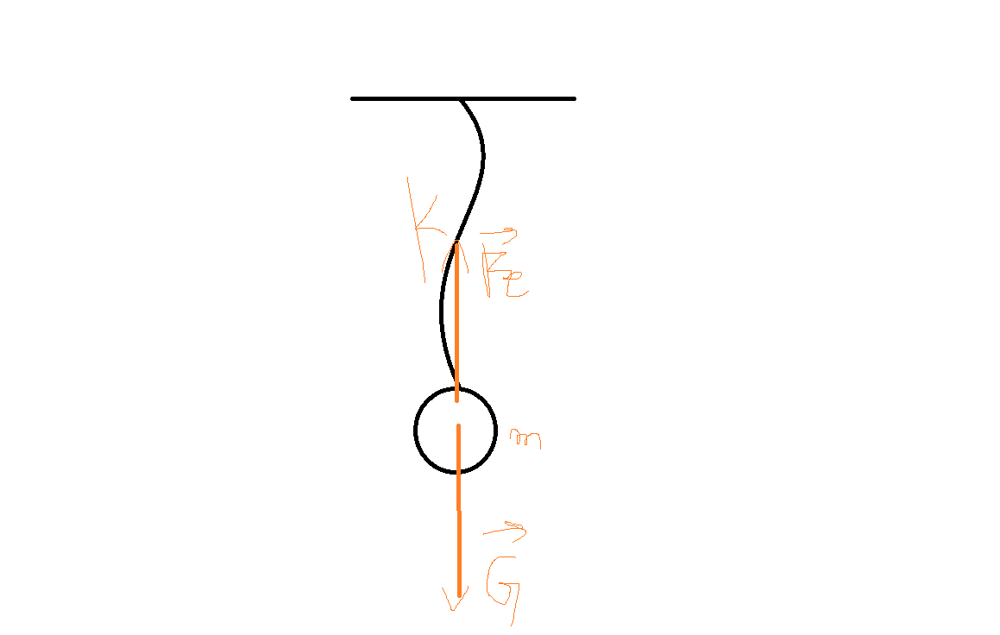
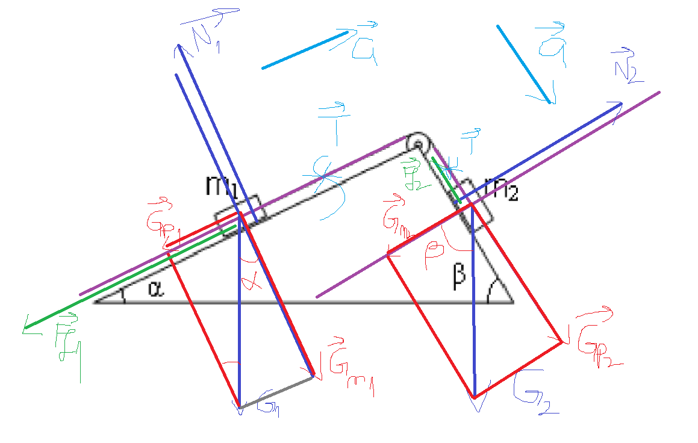

## Subiectul 1
1. b) P = $\frac{L}{\Delta t}$
2. Legea lui Hooke:

$\frac{F}{S} = E \frac{\Delta l}{l_0}$

$k = \frac{F}{\Delta l}$

=> $\frac{F}{\Delta l} = E \frac{S}{l_0} = k$ => c)

3. $m v => kg * m /s =>$

$F = ma => N = kg*m/s^2 => N * s = kg * m/s^2 *s = kg * m /s$ => b)

*$[m]_{S.I} = kg$*

*p = mv (impulsul mecanic)*

4. 

$\vec{a_1} = \frac{\vec{F}}{m}$

$\vec{a_2} = \frac{2\vec{F}}{3m}$

$\vec{F_3} = 3\vec{F} cos \alpha = 3\vec{F} sin(90 - \alpha) = 3\vec{F}/2$

$\vec{a_3} = \frac{\vec{F_3}}{2m} = \frac{3\vec{F}}{4m}$

$a_1 > a_3 > a_2$ a)

5. m => G = m * g

=> $\Delta l = G / k$

=> $L = G * \Delta l = (m * g)^2 / k = 9N^2 / (200 N /m) $ = 0.045 J c)

## Subiectul 2

### a) 

$G_{n1} = G_1 cos \alpha = m_1gcos\alpha = 1kg*10N/kg*\sqrt{3}/2 ~= 8.65N$

$G_{p1} = G_1 sin \alpha = m_1gsin\alpha = 1kg*10N/kg*1/2 = 5N$

### b) 

$G_{p2} = G_2 sin \beta = m_2gsin\beta = 1kg*10N/kg*\sqrt{2}/2 = 7.05N$

Vectorial:

$m_1: Ox: \vec{T} + \vec{G_{p1}} = m_1 \vec{a}$

$m_1: Oy: \vec{G_{n1}} + \vec{N_1} = \vec{0}$

$m_2: Ox: \vec{G_{p2}} + \vec{T} = m_2 \vec{a}$

$m_2: Oy: \vec{G_{n2}} + \vec{N_2} = \vec{0}$

Scalar:

$m_1: Ox: T - G_{p1} = m_1 a$

$m_1: Oy: G_{n1} - N_1 = 0$

$m_2: Ox: G_{p2} - T = m_2 a$

$m_2: Oy: G_{n2} - N_2 = 0$

Din ec. (1) si (3) =>

$G_{p2} - G_{p1} = (m_1 + m_2)a$ =>

$a = \frac{G_{p2} - G_{p1}}{m_1 + m_2} = \frac{m_2gsin\beta - m_1gsin\alpha}{m_1 + m_2} ~ 1.025 m/s^2 $

### c) 

Vectorial:

$m_1: Ox: \vec{T} + \vec{G_{p1}} + \vec{F_{f1}} = m_1 \vec{a'}$

$m_1: Oy: \vec{G_{n1}} + \vec{N_1} = \vec{0}$

$m_2: Ox: \vec{G_{p2}} + \vec{T} + \vec{F_{f2}} = m_2 \vec{a'}$

$m_2: Oy: \vec{G_{n2}} + \vec{N_2} = \vec{0}$

Scalar:

$m_1: Ox: T - G_{p1} - F_{f1} = m_1 a'$

$m_1: Oy: G_{n1} - N_1 = 0$

$m_2: Ox: G_{p2} - T - F_{f2} = m_2 a'$

$m_2: Oy: G_{n2} - N_2 = 0$

Din (2') si (4') =>

$F_{f1} = \mu_1N_1 = \mu_1 G_{n1} = \mu_1 G_1 cos \alpha = \mu_1 m_1 gcos\alpha = 0.1 * 1kg * 10N/kg \sqrt{3}/2 = 0.865N$

$F_{f2} = \mu_2N_2 = \mu_2 G_{n2} = \mu_2 G_2 cos \beta = \mu_2 m_2 gcos\beta = 0.1 * 1kg * 10N/kg \sqrt{2}/2 = 0.7N$

Din ec. (1') si (3') =>

$G_{p2} - G_{p1} - F_{f1} - F_{f2} = (m_1 + m_2)a'$ =>

$a' = \frac{G_{p2} - G_{p1} - F_{f1} - F_{f2}}{m_1 + m_2} = \frac{2.05N - 0.865N - 0.7N}{2kg} ~= 0.24 m/s^2 $

### d)

Vectorial:

$m_1': Ox: \vec{T} + \vec{G_{p1}'} = \vec{0}$

$m_1': Oy: \vec{G_{n1}'} + \vec{N_1'} = \vec{0}$

$m_2: Ox: \vec{G_{p2}} + \vec{T} = \vec{0}$

$m_2: Oy: \vec{G_{n2}} + \vec{N_2} = \vec{0}$

Scalar:

$m_1': Ox: T - G_{p1}' = 0$

$m_1': Oy: G_{n1}' - N_1' = 0$

$m_2: Ox: G_{p2} - T = 0$

$m_2: Oy: G_{n2} - N_2 = 0$

Din ec. (1'') si (3'') =>

$G_{p2} = G_{p1}'$ =>

$m_2gsin\beta = m_1'gsin\alpha $ => 

$m_1' = \frac{m_2sin\beta}{sin\alpha} = \sqrt{2}kg$ =>

$m_1' = m_1 + \Delta m => \Delta m = m_1' - m_1 (kg) ~= 0.41 kg$

## Subiectul 3

### a)

$E_{c0} = \frac{mv_0^2}{2} = 72 J$

### b)

$F_f = \mu N = \mu G = \mu m g = 0.5 * 4kg * 10 N/kg = 20 N$

$L_{Ff} = -F_f * l = -20 N * 1.1m = -22 J$

$L_{Ff} = E_{cB} - E_{cA} => E_{cB} = L_{Ff} + E_{cA} = -22J + 72J = 50J$

$E_{cB} = \frac{mv_b^2}{2} = 50 J => v_b = 5 m/s$

### c) 

$E_p = mgh = 4kg * 10 N/kg * 1.2 m = 48J$

$E_{totala} = E_{cB} + E_p = 50J + 48J = 98J $

### d)

$E_f = E_{cB} = \frac{mv_f^2}{2} = 98J => v_f = 7m/s$