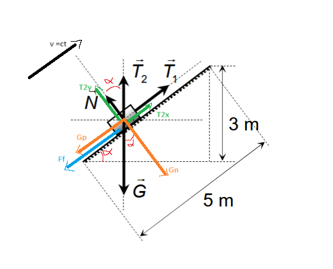
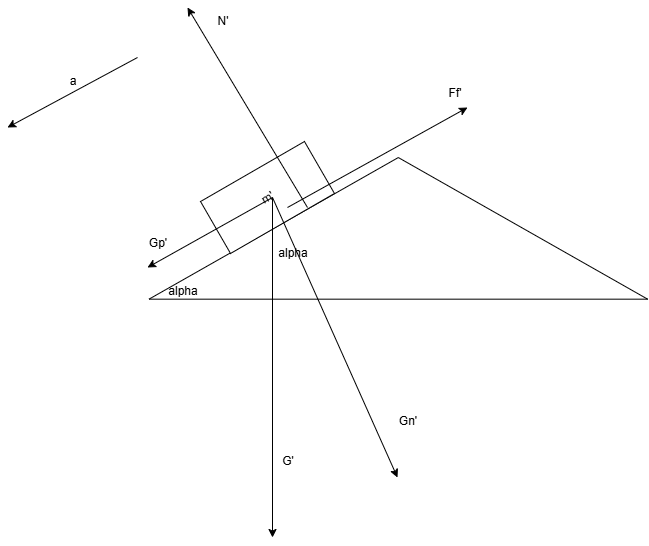
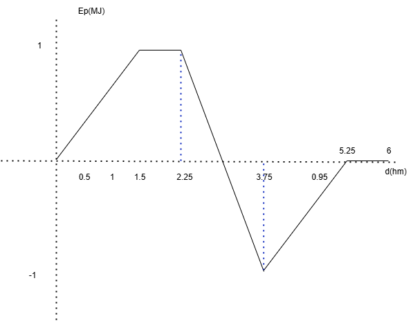
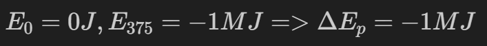

## Subiectul 1
1. b) energia totală va rămâne constantă;
2. $E * t => J * s = kg * m^2/s^2 * s  = kg * m^2/s = m * kg * m/s = N * m * s = W * s^2$ c)

$L = F * d = m * a * d = m * d /t^2 *d = m * d^2 / t^2 => J = N * m = $

$P = \frac{L}{t} => L = P * t$
3. 

$E_a = m_a * g * h_a => m_a = \frac{E_a}{g * h_a} = \frac{90 kg*m^2/s^2}{10m/s^2 * 2m} = 4.5kg$

$E_b = m_b * g * h_b => m_b = \frac{E_b}{g * h_b} = \frac{90 kg*m^2/s^2}{10m/s^2 * 3m} = 3kg$

$E_c = m_c * g * h_c => m_c = \frac{E_c}{g * h_c} = \frac{60 kg*m^2/s^2}{10m/s^2 * 4m} = 1.5kg$

$E_d = m_d * g * h_d => m_d = \frac{E_d}{g * h_d} = \frac{30 kg*m^2/s^2}{10m/s^2 * 3m} = 1kg$

$m_a + m_c = 6 kg$

$m_b + m_d = 4 kg$ => pe talerul din dreapta trebuie adaugate 2 kg c)

4. 
$E_c = \frac{m*v^2}{2} <=> \frac{E_c}{m} = \frac{v^2}{2} = 2J/kg => v = 2 m/s$

5. 

$sin\alpha = 0.6$

$sin^2\alpha + cos^2\alpha = 1 => cos\alpha = \sqrt{1 - sin^2\alpha} = 0.8$

$\eta = \frac{sin\alpha}{sin\alpha + \mu cos\alpha} => sin\alpha + \mu cos\alpha = \frac{sin\alpha}{\eta} => \mu cos \alpha = \frac{sin\alpha}{\eta} - sin\alpha => \mu = \frac{\frac{sin\alpha}{\eta} - sin\alpha}{cos\alpha} = \frac{\frac{0.6}{0.75} - 0.6}{0.8} = \frac{0.2}{0.8} = 25\%$ b)

$\frac{6}{10} * \frac{4}{3} = \frac{2}{5} * \frac{2}{1} = 0.8$

## Subiectul 2

a)

b)

$sin \alpha = \frac{3}{5} => cos \alpha = \frac{4}{5}$

$m = 2500 kg$

$G_p = G sin \alpha = 2500 kg * 10 N/kg * \frac{3}{5} = 15 000 N$

$G_n = G cos \alpha = 2500 kg * 10 N/kg * \frac{4}{5} = 20 000 N$

$F_f = \mu * N = \mu * G_n = \mu * G cos \alpha = \mu 2500 kg * 10 N/kg * \frac{4}{5} = \mu 15 000 N$

$T_{2x} = T_2 sin \alpha = 5000 N \frac{3}{5} = 3000 N$

$T_{2y} = T_2 cos \alpha = 5000 N \frac{4}{5} = 4000 N$

Vectorial:

Ox: $\vec{T_1} + \vec{T_{2x}} + \vec{G_p} + \vec{F_f} = \vec{0}$

Oy: $\vec{G_n} + \vec{T_{2y}} + \vec{N} = \vec{0}$

Scalar:

Ox: $T_1 + T_{2x} - G_p - F_f = 0 => F_f = T_1 + T_{2x} - G_p = 16000N + 3000N - 15000N = 4000N$

Oy: $G_n - T_{2y} - N = 0$

c) 

$N = G_n - T_{2y} = 20000N - 4000N = 16000N$

$\mu = \frac{T_1 + T_{2x} - G_p}{N} = \frac{4}{16}$

d)

m' = 100 kg

$G_p' = G' sin \alpha = 100 kg * 10 N/kg * \frac{3}{5} = 600 N$

$G_n' = G' cos \alpha = 100 kg * 10 N/kg * \frac{4}{5} = 800 N$

Vectorial:

Ox: $\vec{G_p'} + \vec{F_f'} = m'\vec{a}$

Oy: $\vec{N'} + \vec{G_n'} = \vec{0}$

Scalar:

Ox: $G_p' - F_f' = m'a$

Oy: $N' - G_n' = 0$

=> $G_p' - \mu G_n' = m'a => a = \frac{G_p' - \mu G_n'}{m'} = \frac{600N - 200N}{100kg} = 4N/kg = 4 m/s^2$

## Subiectul 3

a) Intervalele in care drumul este orizontal = itervalele in care inaltimea nivelului nu se schimba = intervalele in care Ep = ct (0.2 - 0.3 min si 0.7 - 0.8 min)

b) $E_p = mgh <=> 1 000 000 J = 10 000kg * 10 N/kg * h => h = 10 m$

c)

$v_0 = 45km/h = 45 \frac{1000m}{3600s} = 12.5m/s, t_1 = 0.2 min = 0.2 * 60s = 12s => d_1 = v_0 * t = 12.5 m/s * 6s = 150m, t_2 = 0.1 min = 0.1 * 60s = 6s => d_2 = v_0 * t = 12.5 m/s * 6s = 75m$

d) 