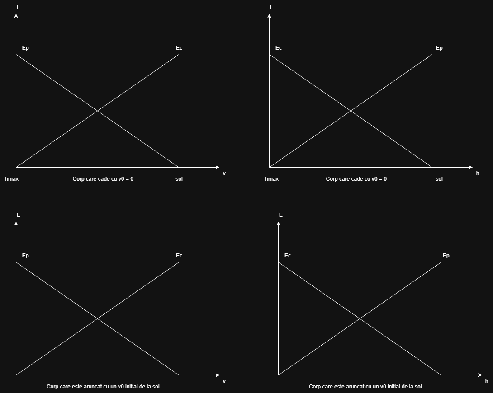
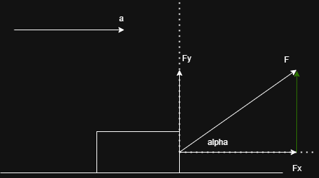
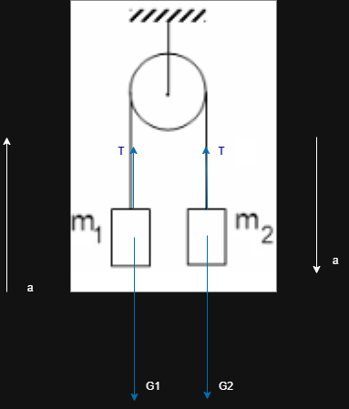
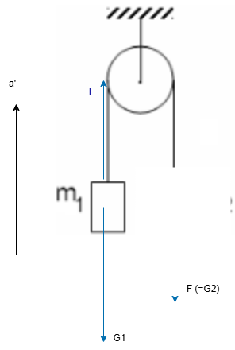
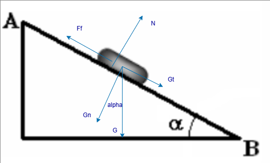

## Subiectul 1
1. $\frac{\vec{F}}{m} = \frac{m\vec{a}}{m} = \vec{a} => [a]_{S.I.} = m/s^2$ b)

2. 
Legea lui Hooke:
$\frac{F}{S} = E\frac{\Delta l}{l_0} => \Delta l = \frac{Fl_0}{SE}$
Aplicat pe resortul 1:
$\frac{F}{S} = E_1\frac{\Delta l_1}{l_0}  => \Delta l_1 = \frac{Fl_0}{SE_1}$
Aplicat pe resortul 2:
$\frac{F}{S} = E_2\frac{\Delta l_2}{l_0}  => \Delta l_2 = \frac{Fl_0}{SE_2}$ =>

$\frac{\Delta l_1}{\Delta l_2} = \frac{E_2}{E_1} = 3$ => b)

3. 

Distanta d:
- d/2 parcursa cu $v_1 (d/2 = v_1t_1) => t_1 = \frac{d}{2v_1}$
- d/2 parcursa cu $v_2 (d/2 = v_2t_2)  => t_2 = \frac{d}{2v_2}$

Viteza medie:
$v_m = \frac{d_{totala}}{t_{total}} = \frac{d}{t_1 + t_2} = \frac{d}{\frac{d}{2v_1} + \frac{d}{2v_2}} = \frac{d}{\frac{dv_2+dv_1}{2v_1v_2}} = \frac{2v_1v_2}{v_1+v_2}$ a)

4. Absenta frecari => energia se conserva => $E_c$ la nivelul solului = $E_p$ la inaltimea maxima

$E_c sol = \frac{m v_0^2}{2}$

$E_c la jumate = \frac{m v_0^2}{4} = E_p la jumate = mgh$
 => $\frac{v_0^2}{4} = gh => h = \frac{v_0^2}{4g}$ d)

5. 

$F_x = fcos\alpha => L = F_xd = Fcos\alpha d = 6N \frac{\sqrt{3}}{2}2m = 6\sqrt{3}J$ b)

## Subiectul 2

a) desen
b) a = ?
Vectorial:
$m_1$: $\vec{G_1} + \vec{T} = m_1\vec{a}$
$m_2$: $\vec{G_2} + \vec{T} = m_2\vec{a}$
Scalar:
$m_1$: $T - G_1 = m_1a$
$m_2$: $G_2 - T = m_2a$
=> $G_2 - G_1 = (m_1 + m_2) a => a = g\frac{m_2 - m_1}{m_1 + m_2} = 10 N/kg \frac{2kg - 1kg}{1kg + 2kg} = \frac{10}{3} m/s^2 \~= 3.33(m/s^2)(N/kg)$
c) T = ?
$T = m_1a + G_1 = m_1 (a+g) = \frac{40}{3}N$
d) 

Vectorial: $m_1$:
$\vec{F} + \vec{G_1} = m_1\vec{a'}$

Scalar: $m_1$:
$F - G_1 = m_1a'$

$F = G_2$

=> $a' = \frac{G_2 - G_1}{m_1} = 10 m/s^2$

## Subiectul 3

a) $E_pA = mgh = 0.25 kg * 10N/kg * 0.5m = 1.25 J (E_A = E_{pA})$
b) $L_{F_f} = -F_fd$

$sin \alpha = \frac{h}{d} => d = \frac{h}{sin \alpha} = \frac{0.5m}{1/2} = 1m$

$F_f = \mu N = \mu G_n = \mu G cos \alpha = \frac{1}{2\sqrt{3}} 2.5 N \frac{\sqrt{3}}{2} = 2.5/4 N$

=> L = -2.5/4 J

c)

$E_{cB} - E_{cA} = L_{total} (L_{total} = L_{F_f} + L_{G_t})$

$L_{G_t} = G_td = G sin\alpha d = mgsin\alpha d = 5/4 J = 1.25 J$

$E_{cB} - 0 = L_{total} (L_{total} = 2.5/4 J)$

d)

$E_cB = \frac{mv^2}{2} = \frac{2.5}{4}J => v^2 = \frac{2.5}{2} * 4 = 5 => v = \sqrt{5}m/s$