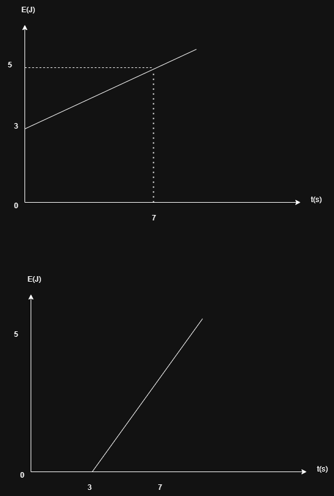
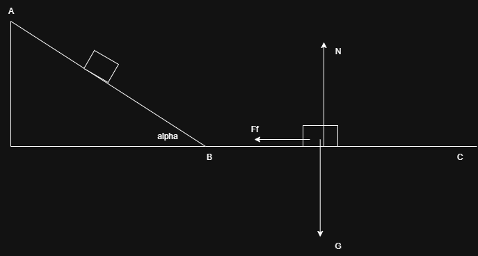

## Subiectul 1
1. $\mu g = ?$

$\mu = adimensional (coeficientul\ de\ frecare\ la\ alunecare)$

$g = m/s^2 (acceleratia\ gravitationala)$ =>

$\mu g = m/s^2 (c))$

2. m = 100g = 0.1 kg, F = 2N => a = ?

$F = ma => a = \frac{F}{m} = \frac{2N}{0.1kg} = 20 N/kg (m/s^2) (d))$

3. m = 60 kg, d = 20m, t = 4s => $E_c = ?$

$v = \frac{d}{t} = \frac{20m}{4s} = 5m/s$

$E_c = \frac{mv^2}{2} = \frac{60 kg 25 m^2/s^2}{2} = 750J$(c))

4. 

$L_{necesar} = L_{rezistent} = G_{tmediu}l$

$G_{tmediu} = \frac{G_{tmax} + G_{tmin}}{2}$

$G_{tmax} = G_t = Gsin\alpha = mgsin\alpha$

$G_{tmin} = 0$

$G_{tmediu} = \frac{mgsin\alpha}{2}$

$L = \frac{mgsin\alpha}{2} l$ (d))

5. Legea lui Hooke: $\frac{F}{S} = E\frac{\Delta l}{l_0}$

$F = G = mg$

$l_0 = \frac{E \Delta l S}{mg}$ (b))

## Subiectul 2
m = 2kg, F = 10N, v conform graficului

a) a = ?

$a = \frac{\Delta v}{\Delta t} = \frac{v_f - v_i}{t_f - t_i} = \frac{10 m/s - 0}{5s - 0} = 2 m/s^2$

b) 

c) $\mu = ?$

Vectorial:

Ox: $\vec{F} + \vec{F_f} = m \vec{a}$

Oy: $\vec{G} + \vec{N} = \vec{0}$

Scalar:

Ox: $F - F_f = m a$

Oy: $G - N = 0$

d) 

$\mu' = ?, t_1 = 5s, t_2 = 7s (se\ opreste)$ 

$a' = \frac{v_2 - v_1}{t_2 - t_1} = \frac{0 - 10 m/s}{7s - 5s} = -5 m/s^2$

Vectorial:

Ox: $\vec{F_f} = m\vec{a'}$

Oy: $\vec{G} + \vec{N} = 0$

Scalar:

Ox: $-F_f = ma'$

Oy: $G - N = 0$

=> N = G = mg, $F_f = -ma', F_f = \mu' N => \mu' = \frac{F_f}{N} = \frac{-ma'}{mg} = 0.5$

## Subiectul 3

m = 1kg, $\alpha = 30\degree, \mu = 0.25 (pe planul orizontal), v = 25 m/s (la baza planului inclinat)$

a) $E_{cB} = \frac{mv^2}{2} = \frac{1kg*625m^2/s^2}{2} = 312.5J$

b) $E_{cB} = E_{pA} (energia se conserva, nu exista forte de rezistenta) => E_{pA} = mgh => h = \frac{E_{pA}}{mg} = \frac{312.5J}{1kg* 10N/kg} = 31/25m$

c) $E_{pmax} = E_{pA} = 312.5J$

d) 

Vectorial:

Ox: $\vec{F_f} = m\vec{a}$

Oy: $\vec{G} + \vec{N} = 0$

Scalar:

Ox: $-F_f = ma$

Oy: $G - N = 0$

=> N = G = mg, $F_f = -ma, F_f = -\mu N = -0.25 * 10N = -2.5N => a = -\frac{2.5N}{1kg} = -2.5 N/kg(m/s^2)$

$v_f^2 = v_i^2 + 2ad => d = -\frac{v_i^2}{2a} = -\frac{625m^2/s^2}{-5m/s^2} = 125m$