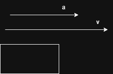
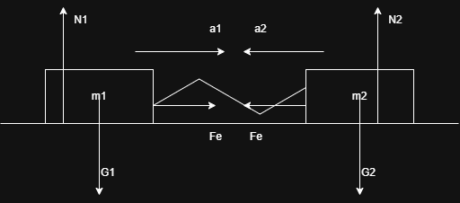
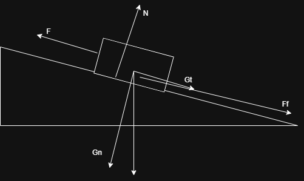
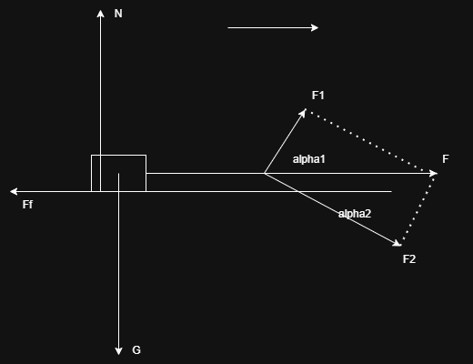
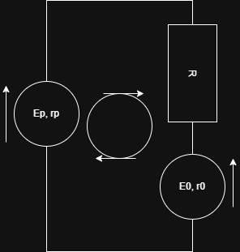

## Subiectul 1
1. b) 

2. a)
3. c)
4. 

$m_1: Ox: \vec{F_e} = m_1 a_1$
$m_2: Ox: \vec{F_e} = m_2 a_2$

$m_1: Ox: F_e = m_1 a_1$
$m_2: Ox: F_e = m_2 a_2$
=> $m_1 a_1 = m_2 a_2 => \frac{a_1}{a_2} = \frac{m_2}{m_1}$ d)
5. 

$\eta = \frac{sin \alpha}{ sin \alpha + \mu cos \alpha} (simplificam\ prin\ cos \alpha) = \frac{\frac{sin \alpha}{cos \alpha}}{\frac{sin \alpha}{cos \alpha} + \mu \frac{cos \alpha}{cos \alpha}} = \frac{tg \alpha}{tg \alpha + \mu} => tg \alpha + \mu = \frac{tg \alpha}{\eta} => \mu = \frac{tg \alpha}{\eta} - tg \alpha = \frac{1.8}{0.8} - 1.8 = 0.45$ a)
## Subiectul 2

a) N = ?
Din ecuatia vectoriala pe Oy a corpului => N = G = mg = 1000N
b) F = ?
$m: Ox: \vec{F} + \vec{F_f} = m \vec{a}$ =>
$m: Ox: F - F_f = m a => F = F_f + ma $
$F_f = \mu N$ => $F = \mu N + ma = 0.2 * 1000N + 100 kg * 1m/s^2 = 300 N$
c) $\alpha_1 si \alpha_2$
$F_1 = Fcos\alpha_1 = Fsin\alpha_2 => cos\alpha_1 = \frac{F_1}{F} = \frac{1}{2} => \alpha_1 = 60\degree => \alpha_2 = 30\degree$
d) $Scalar: -F_f = ma' => a' = -\frac{F_f}{m} = -2m/s^2$
## Subiectul 3
a) v = ct => rezultanta fortelor este 0 (nu este ca in barem) (P = Fv => F) (In schimb forta de traciune se poate afla din putere si viteza)
b) L rezistent
$\Delta E_c = L_{total} <=> E_{cf} - E_{ci} = L_{rezistent} = 0 - \frac{m*v^2}{2} = - \frac{800 kg * 225 m^2/s^2}{2} = - 90 kJ$
$54*\frac{1000m}{3600s} = 15m/s$
d) $\Delta t = ?$
$P = \frac{L}{\Delta t} => \Delta t = \frac{L}{P} = \frac{90kJ}{15kW} = 6s$ (nu e ca in barem)
c)
$v_f = v_i + a \Delta t => a = \frac{v_f - v_i}{\Delta t} = \frac{-15m/s}{6s} = 2.5 m/s^2$ (nu e ca in barem)

$v_f^2 = v_i^2 + 2ad => d = \frac{v_f^2 - v_i^2}{2a} = \frac{-225m^2/s^2}{5m/s^2} = 45m$

(Vezi barem)

### Curent V3 S2 d) 

$E_p - E_0 = I (r_0 + r_p + R)$