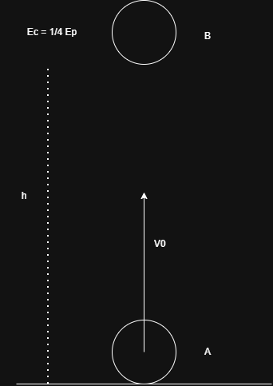
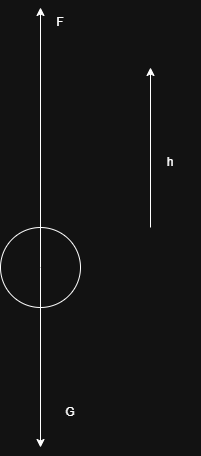
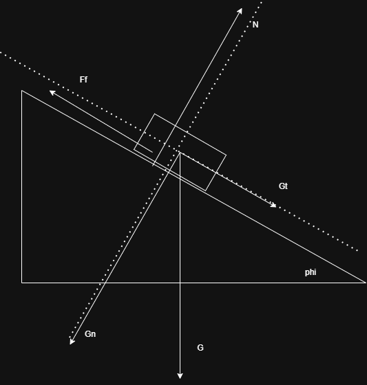
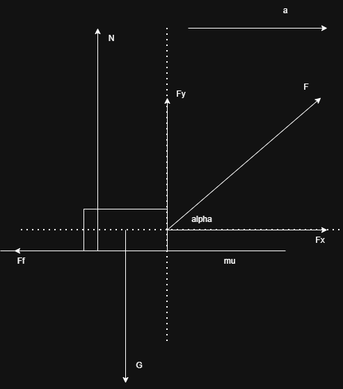
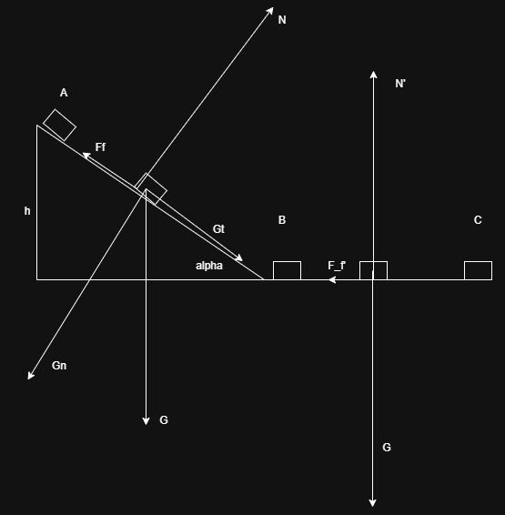

## Subiectul 1
1. $10\frac{g}{cm^3} = 10\frac{10^{-3}kg}{10^{-6}m^3} = 10^4 \frac{kg}{m^3}$ a)
2. c)
3. d)
4. 

$E_{c0} = \frac{mv_0^2}{2} = E_t$
$E_{cB} = \frac{1}{4} E_{pB}$
$E_{cB} + E_{pB} = E_t$
$\frac{1}{4} E_{pB} + E_{pB} = E_t$
$\frac{1}{4} mgh + mgh = \frac{mv_0^2}{2}$
$5gh = 2v_0^2 => h = \frac{2v_0^2}{5g} = \frac{2 * 100 m^2/s^2}{5 * 10 m/s^2} = 4 m$ d)
5. 

$P = \frac{L}{\Delta t} => \Delta t = \frac{L}{P} = \frac{mgh}{P} = \frac{4 * 10^3 kg * 10N/kg * 20 m}{20 * 10^3 W} = 40 s$
$L = Fd = Gh (F = G\ ca\ modul, v = ct)$ c)
## Subiectul 2
a)

b) $\mu = ?$
Vectorial:
Ox: $\vec{G_t} + \vec{F_f} = \vec{0}$
Oy: $\vec{N} + \vec{G_n} = \vec{0}$

Scalar:
Ox: $G_t - F_f = 0 => G sin \phi = \mu G cos \phi => \mu = tg \phi = \frac{\sqrt{3}}{3}$
Oy: $N - G_n = 0$

c)

Vectorial:
Ox: $\vec{F_x} + \vec{F_f} = \vec{0}$ // -- by default, nu specifica in pb
Oy: $\vec{N} + \vec{G} + \vec{F_y} = \vec{0}$

Scalar:
Oy: $N + G - F_y = 0 => G = F_y = F sin \alpha => sin \alpha = \frac{G}{F} = \frac{2}{3}$ (N = 0) (minim)

d)
Vectorial:
Ox: $\vec{F_x} + \vec{F_f} = m\vec{a}$
Oy: $\vec{N} + \vec{G} + \vec{F_y} = \vec{0}$

Scalar:
Ox: $F_x - F_f = ma => a = \frac{F_x - F_f}{m} = \frac{Fcos\beta - \mu (mg - F sin \beta)}{m} = \frac{10N \frac{\sqrt{3}}{2} - \frac{\sqrt{3}}{3} (10N - 10N \frac{1}{2})}{1kg} = 10N/kg*\frac{\sqrt{3}}{3}$
Oy: $N - G + F_y = 0 => N = G - F_y = mg - F sin \beta$

## Subiectul 3

a) $E_{cB} = ?$
$Vectorial -> Scalar -> N = G_n = Gcos\alpha => F_f = \mu N = \mu mg cos \alpha => L_{F_f} = -F_f d = - \mu mg cos \alpha \frac{h}{sin\alpha}$
$L_{G_t} = mgsin\alpha \frac{h}{sin\alpha} = mgh$
$E_{cB} - 0 = mgh - \mu mg cos \alpha \frac{h}{sin\alpha} = mgh(1 - \mu ctg\alpha) = 5 J $

b) $L_{F_{fAC}} = L_{F_{fAB}} + L_{F_{fBC}}= -10J $

$L_{F_{fBC}} = E_{cC} - E_{cB} = -5J$

sau

$E_C - E_A = L_{F_ftotal} = -mgh = -10J$

c) 

$L_{F_{fBC}} = E_{cC} - E_{cB} = -5J = -F_f'd' = - \mu mg d' => d' = \frac{-5J}{-\frac{1}{2\sqrt{3}} 1kg * 10N/kg} = \sqrt{3} m$

d)
$E_{pA} = E_{cB} <=> mgh = \frac{mv'^2}{2} => v'^2 = 2gh => v' = \sqrt{2gh} = \sqrt{2*10m/s^2 * 1m} = \sqrt{20}m/s$