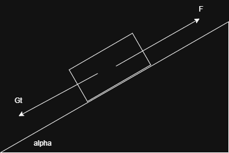
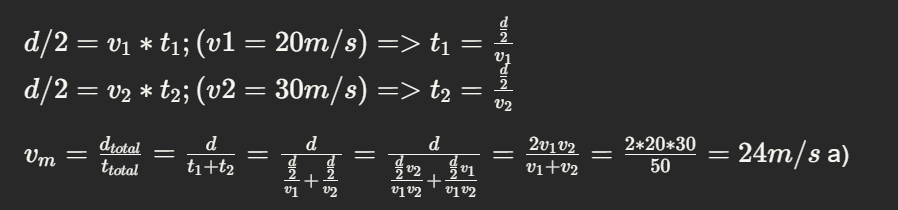
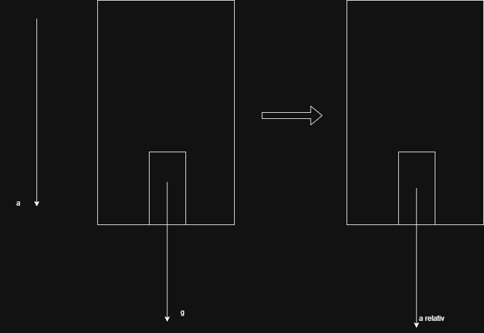
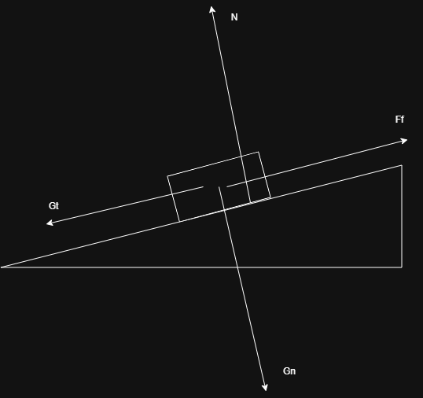
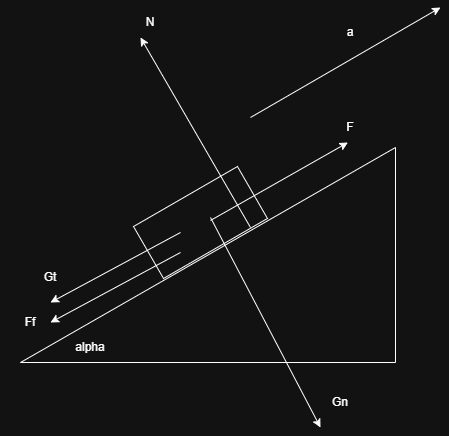
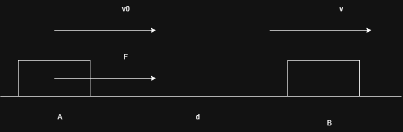
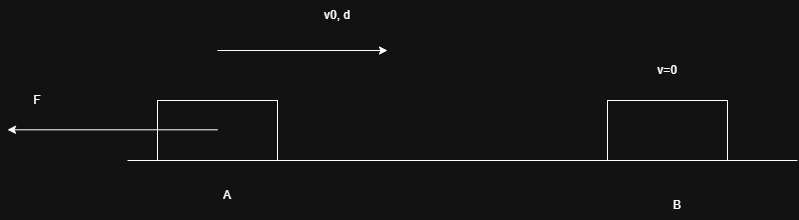
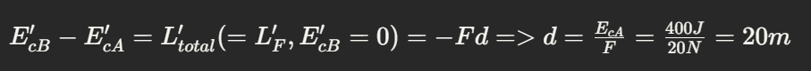
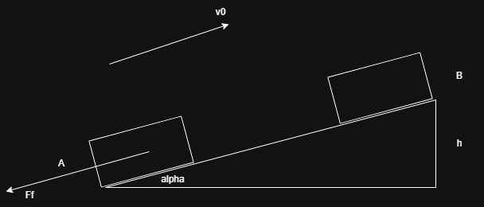

## Subiectul 1
1. $J/h => \frac{L}{t} => Fd/t => mad/t => m* d/t^2 * d/t => m*d^2/t^3 => kg * m^2/s^3$

$72kj/h = 72\frac{1000J}{3600s} = 20\frac{J}{s} = 20 \frac{Nm}{s} = 20 \frac{kg*\frac{m}{s^2}m}{s} (20W)$

2. $\frac{F}{\sigma} = S (m^2) b)$

$\sigma = \frac{F}{S}$

3.  a)

4. 

5. 

Acceleratia relativa a individului fata de lift este $a_{individ} - a_{lift} (a_{individ} = g) = 10 m/s^2 - 2m/s^2 = 8m/s^2$

Raportul cerut este de fapt raportul dintre acceleratia individului si cea relativa fata de lift

$r = \frac{g}{a_{relativ}} = \frac{10}{8} = 1.25$ b)

## Subiectul 2
a) 

$sin\alpha = \frac{F}{mg} = \frac{50N}{100N} => sin \alpha = 30\degree$
b) 
c) 
$F_f = \mu mg cos\alpha$ (indiferent de tipul de miscare al corpului pe plan)
d)  
## Subiectul 3
a) 

 $E_{cB} - E_{cA} = L_{total} (= L_F) = Fd => E_{cA} = E_{cB} - L_F = 400J = \frac{mv_0^2}{2} => m = 8kg$

b) $P = Fv => P_{mediu} = F(\frac{v_0 + v}{2}) = 20N * 10m/s \frac{1+1.41}{2} = 100*2.41Nm/s$

$v = \sqrt{\frac{2E_{cB}}{m}} = 10\sqrt{2}m/s$

c) 

d) 

$E_{B} - E_{A} = L_{F_f}$

$E_{pB} - E_{cA} = -F_fd$

$mgh - \frac{mv_0^2}{2} = -\mu mg cos\alpha \frac{h}{sin\alpha}$

$gh - \frac{v_0^2}{2} = -\mu g cos\alpha \frac{h}{sin\alpha}$

$hg(1 + \mu ctg\alpha) = \frac{v_0^2}{2}$

$h = \frac{v_0^2}{2g(1 + \mu ctg\alpha)} = ...$

$d = \frac{h}{sin\alpha}$