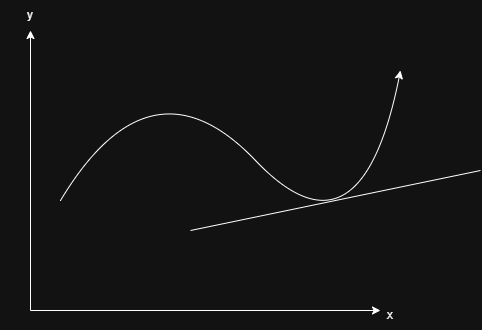
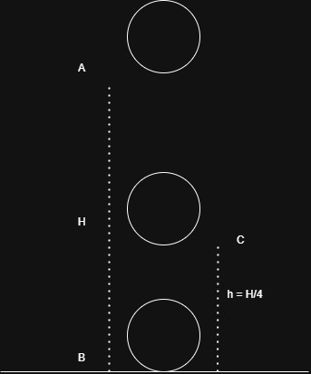
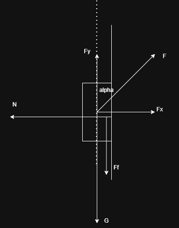
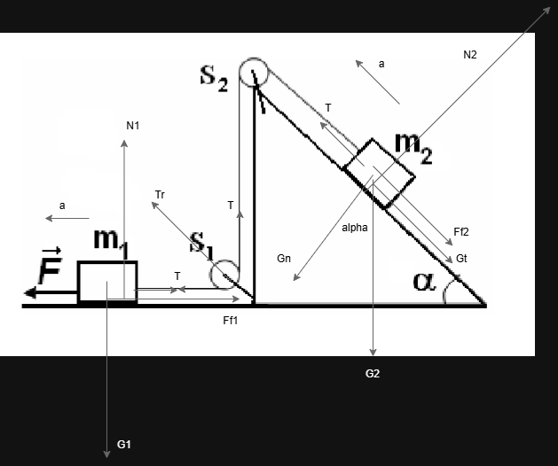
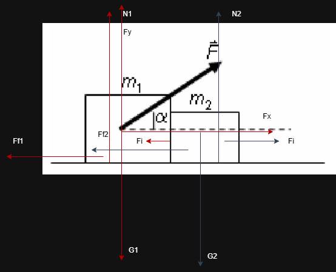

### Subiectul 1
1. c)

2. b)
3. d) 

4. d)

5. d)

### Subiectul 2
b) 

Vectorial:

$m_1: Ox: \vec{F} + \vec{T} +{F_{f1}} = m_1 \vec{a}$

$m_1: Oy: \vec{G_1} + \vec{N_1} = \vec{0}$

$m_2: Ox: \vec{T} + \vec{G_t} + \vec{F_{f2}} = m_2 \vec{a}$

$m_2: Oy: \vec{G_n} + \vec{N_2} = \vec{0}$

Scalar:

$m_1: Ox: F - T - F_{f1} = m_1 a$

$m_1: Oy: G_1 - N_1 = 0$

$m_2: Ox: T - G_t - F_{f2} = m_2 a$

$m_2: Oy: G_n - N_2 = 0$

Echivalent cu a scrie:

$m_1: Ox: F - T - F_{f1} = m_1 a$

$m_1: Oy: N_1 = m_1g$

$m_2: Ox: T - G_t - F_{f2} = m_2 a$

$m_2: Oy: N_2 = m_2g cos\alpha$

=>

$F - F_{f1} - F_{f2} - G_t = (m_1 + m_2)a$

<=>

$F_{f1} = \mu N_1 = \mu m_1g$

$F_{f2} = \mu N_2 = \mu m_2g cos\alpha$

$F - \mu m_1g - \mu m_2g cos\alpha - m_2gsin\alpha = (m_1 + m_2)a$

=> 

$a = \frac{F - \mu g (m_1 -  m_2 cos\alpha) - m_2gsin\alpha}{m_1 + m_2}$

### Subiectul 3

a)

$L_F = F_x d = F cos \alpha d => F = \frac{L_F}{cos\alpha d} = \frac{173J}{10m * 1/2 * 1.73} = 20N$

b) 

Spoiler: $F_i$ - ul este forta de interactiune dintre cele 2 corpuri, se comporta identic cu o forta de tensiune.

Vectorial:

$m_1: Ox: \vec{F_x} + \vec{F_i} + \vec{F_{f1}} = m_1 \vec{a}$

$m_1: Oy: \vec{G_1} + \vec{N_1} + \vec{F_y} = \vec{0}$

$m_2: Ox: \vec{F_i} + \vec{F_{f2}} = m_2 \vec{a}$

$m_2: Oy: \vec{G_2} + \vec{N_2} = \vec{0}$

Scalar:

$m_1: Ox: F_x - F_i - F_{f1} = m_1 a$

$m_1: Oy: G_1 - N_1 - F_y = 0 => N_1 = G_1 - F_y = m_1g - Fsin\alpha$

$m_2: Ox: F_i - F_{f2} = m_2 a$

$m_2: Oy: G_2 - N_2 = 0$

$F_{f1} = \mu N_1 = \mu ( m_1g - Fsin\alpha) $

$F_{f2} = \mu N_2 = \mu m_2g $

$L_{F_f1} = -(F_{f1} + F_{f2})d = -\mu gd(m_1 - Fsin\alpha + m2) => \mu = \frac{L_{F_f1}}{gd(m_1 - Fsin\alpha + m2)}$

c)

(din ecuatiile scalare 1 si 3) =>

$F_x - F_f1 - F_f2 = (m_1 + m_2)a => a = \frac{F_x - F_f1 - F_f2}{m_1 + m_2} = \frac{Fcos\alpha -\mu g(m_1 - Fsin\alpha + m2)}{m_1 + m_2}$

sau inlociun suma frecarilor din relatia cu lucrul mecanic al lor

$Fcos\alpha + \frac{L_{F_f1}}{d} = (m_1 + m_2)a => a = \frac{Fcos\alpha + \frac{L_{F_f1}}{d}}{m_1 + m_2}$

$v_f^2 = v_i^2 + 2ad$

=>

$v_{m2} = \frac{0 + v_f}{2}$

=>

$P_{medieF_f} = F_{f2}v_{m2}$