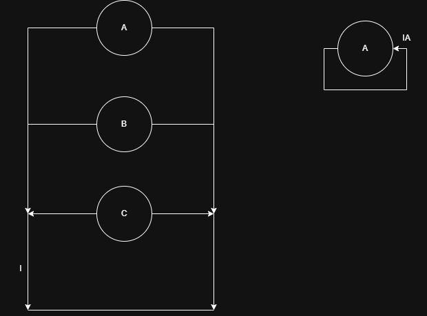
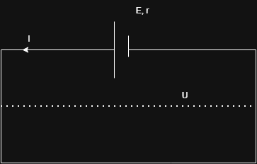
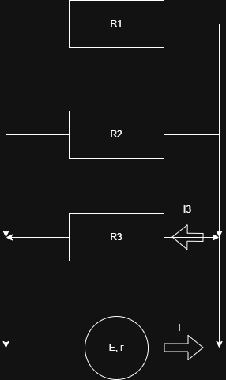

## Rezolvari curent varianta 5 subiectul 1
3. 

I-uri la scurtcircuit => $I_{paralel} = I_1 + I_2 + I_3 = 30A$

$E = \frac{\frac{E_1}{r_1} + \frac{E_2}{r_2} + \frac{E_3}{r_3}}{\frac{1}{r_p}} = \frac{I_1 + I_2 + I_3}{\frac{1}{r_p}} = \frac{30A}{\frac{1}{1.2\Omega}} = 36V$ d)

## Rezolvari curent varianta 6 subiectul 2

a)
$I = \frac{E}{R + r}$

$E = IR + Ir (U + u)$

Cand I este 0 (sau foarte mic) => R este infinit (sau foarte mare) => $Ir$ este foarte mic (se poate neglija sau aproxima cu 0) => $E = IR = U (50V)$

b) Rezistenta exterioara nula => scurtcircuit pe baterie => U = 0 => I = 5A

c) r = $\frac{E}{I_s} = \frac{50V}{5A} = 10 \Omega$

## Rezolvari curent varianta 7 subiectul 1

3. $I_s = \frac{E}{r}, I = \frac{E}{R + r}, \eta = \frac{R}{R + r} = \frac{\frac{E}{I} - \frac{E}{I_s}}{\frac{E}{I}} = \frac{I_s - I}{I_sI}I$

$r = \frac{E}{I_s}$

$R + r = \frac{E}{I} => R = \frac{E}{I} - \frac{E}{I_s}$ 

1.

$I_s = I_p$

$I_s = \frac{E_s}{r_s + R} = \frac{nE}{nr + R}$

$I_p = \frac{E}{\frac{r}{n} + R}$

$\frac{n}{nr + R} = \frac{1}{\frac{r}{n} + R} => n(\frac{r}{n} + R) = nr + R => r + nR = nr + R => (n - 1)R = (n - 1)r => R = r$

----------------------------------------------

$I_1 + I_2 = \frac{25}{11}A$

$I_1 - I_2 = 5A$

=> $2I_1 = \frac{80}{11} => I_1 = \frac{80}{22} = 3.63A$

----------------------------------------------

