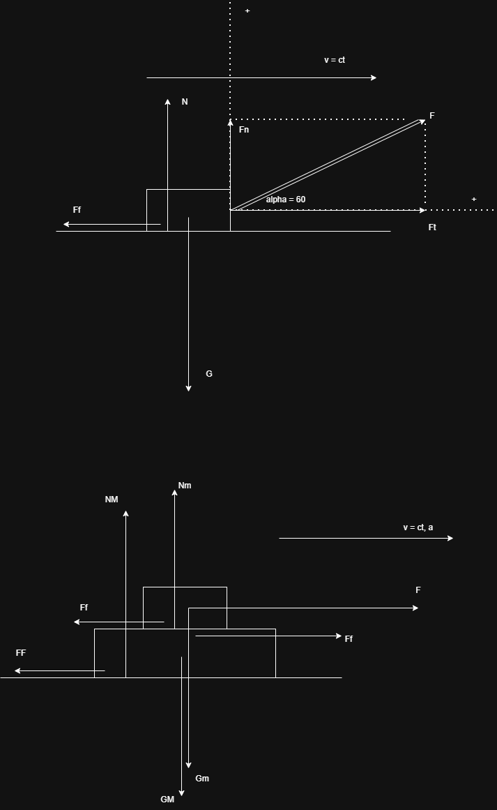

1.

Decompunere fortelor pentru usurinta calculului.
Se insumeaza fiecare forta in functie de axa pe care se afla in sistemul de axe ortogonale ales.

Vectorial:
Ox (orizontala): $\vec{F_t} + \vec{F_f} = \vec{0}$

Oy(verticala): $\vec{G} + \vec{N} + \vec{F_n} = \vec{0}$

Scalar:

Ox (orizontala): $F_t - F_f = 0$

Oy(verticala): $F_n + N - G = 0$

$sin\alpha = \frac{F_n}{F} => F_n = F sin \alpha$

$cos\alpha = \frac{F_t}{F} => F_t = F cos \alpha$

$F_f = \mu N$

$G = mg$

=>

Ox (orizontala): $F_t = F_f <=> F cos \alpha = \mu N$

Oy(verticala): $F_n + N - G = 0 <=>  F sin \alpha + N - mg = 0$

Se da m = 5kg, F = 40N, $\alpha = 60\degree$ => $\mu = ?$

Din Oy => $N = mg - F sin \alpha$

=> Ox: $F cos \alpha = \mu (mg - F sin \alpha) => \mu = \frac{F cos \alpha}{mg - F sin \alpha} = \frac{40 N \frac{1}{2}}{5 kg * 10 N/kg - 40 N * \frac{\sqrt{3}}{2}} = \frac{2}{5 - 2 \sqrt{3}} = $

2. acelasi desen, m = 20 kg, $\mu = 0.5, \alpha = 45\degree$ => F = ?

Scalar:

Ox (orizontala): $F cos \alpha - \mu N = 0$

Oy(verticala): $F sin \alpha + N - mg = 0$

=> 

$F cos \alpha - \mu (mg - F sin \alpha) = 0 <=> F cos \alpha - \mu mg + \mu F sin \alpha = 0 => F(cos \alpha + \mu sin \alpha) - \mu mg = 0 => F = \frac{\mu mg}{cos \alpha + \mu sin \alpha} = \frac{0.5 * 20 kg * 10 N/kg}{\frac{\sqrt{2}}{2} + 0.5 \frac{\sqrt{2}}{2}} = \frac{400}{3\sqrt{2}} = ...$
