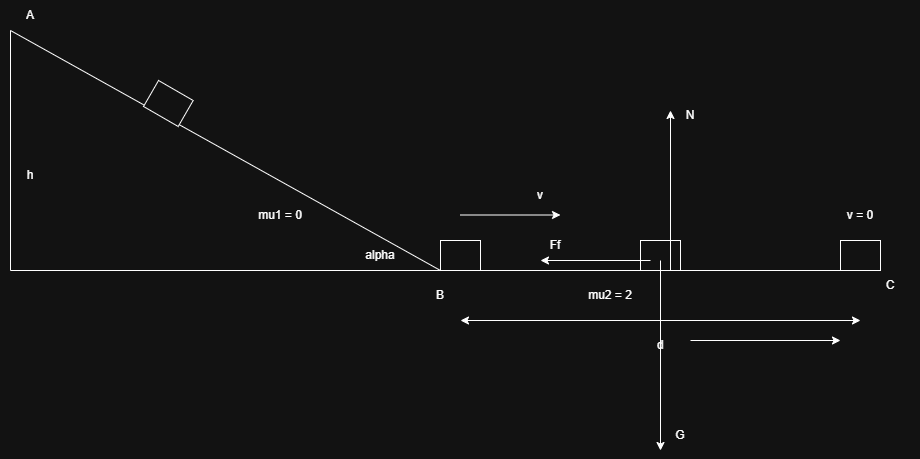
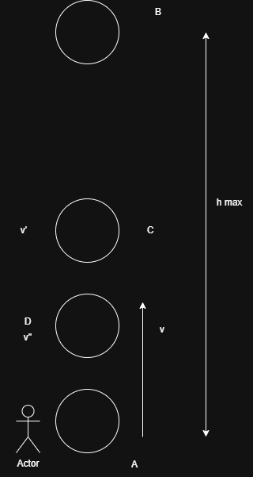

1.

[formule](https://www.ebacalaureat.ro/bac/lectii/fizica/teorie-FIZICA-bacalaureat.pdf)

$\alpha = 30 \degree $
m = 5 kg
$\mu_2 = 2$

a) h = ? daca v = 10m/s

b) $L_{F_f} = ? (orizontala)$

c) d pana la oprire

Rezolvare:

a) $E_A = E_{cA} + E_{pA}, E_{cA} = 0 => E_A = E_{pA} = mgh$

$E_B = E_{cB} + E_{pB}, E_{pB} = 0 => E_B = E_{cB} = \frac{mv^2}{2}$

$E_A = E_B => mgh = \frac{mv^2}{2} => h = \frac{v^2}{2g} = \frac{100 m^2/s^2}{2*10m/s^2} = 5m$

b) Teorema de variatie a energiei cinetice

$\Delta E_c = L_{total} => E_{cC} - E_{cB} = L_{F_f} => 0 - 250J = L_{F_f} = -250J$

c) $L_{F_f} = -F_f d$

$F_f = \mu_2N = \mu_2mg => d = \frac{L_{F_f}}{\mu_2mg} = \frac{250J}{2*5kg*10N/kg} = 2,5m$

2. 

m = 100g = 0,1 kg, v = 10 m/s

a) $h_{max}$

b)v' (la jumatate din $h_{max}$)

c)h la care viteza este 75% din cea initiala

Rezolvare:

a) $E_A = E_B, E_A = E_{cA}, E_B = E_{pB} => E_{cA} = E_{pB} <=> \frac{mv^2}{2} = mgh_{max} => h_{max} = \frac{v^2}{2g} = \frac{100m^2/s^2}{2*10m/s^2} = 5 m$

b) $h_C = \frac{h_{max}}{2} => E_{pC} = \frac{mgh_{max}}{2} = 2,5J$

$E_C = E_{cC} + E_{pC} => E_{cC} = E_C - E_{pC} = 5J - 2,5J = 2,5J$

$E_{cC} = \frac{mv'^2}{2} => v' = \sqrt{\frac{2E_{cC}}{m}} = \sqrt{\frac{2*2,5J}{0,1kg}} = 5\sqrt{2}m/s$

c) $v'' = \frac{75}{100} 10m/s = 7,5m/s => E_{cD} = \frac{mv''^2}{2} = 2,8125J$

$E_D = E_{cD} + E_{pD} => E_{pD} = E_D - E_{cD} = 5J - 2,8125J = 2,1875J$

$E_{pD} = mgh_D => h_D = \frac{E_{pD}}{mg} = \frac{2,1875J}{1N} = 2,1875m$