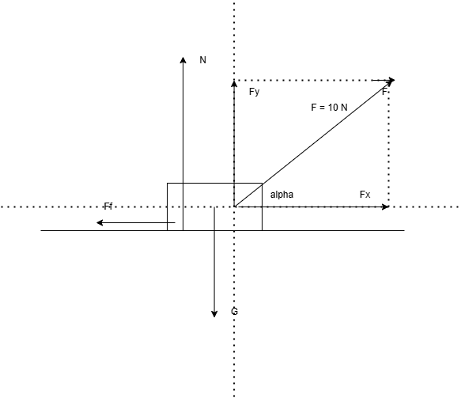
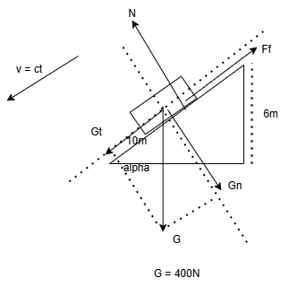
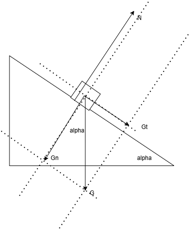

Vector:
- originea (punctul de aplicatie)
- directie
- sens
- cantitate (modul) (valoare numerica + unitatea de masura)

#### 1. [Pe un derdeluș (plan înclinat) cu înălțimea de 6 m și lungimea de 10 m, un copil cu greutatea de 400 N coboară uniform pe o folie de plastic. Reprezintă grafic forțele ce acționează asupra copilului și determină modulele acestor forțe.](https://www.fizichim.ro/docs/fizica/clasa7/capitolul2-interactiuni-mecanice/II-16-miscarea-unui-corp-pe-un-plan-inclinat/II-16-2-coborarea-uniforma-a-unui-corp-pe-un-plan-inclinat/)

Vectorial:

Ox: $\vec{G_t} + \vec{F_f} = \vec{0}$

Oy: $\vec{G_n} + \vec{N} = \vec{0}$

Scalar:

Ox: $G_t - F_f = 0$

Oy: $G_n - N = 0$

$sin\alpha = \frac{cateta\ opusa}{ipotenuza} = \frac{inaltimea\ planului}{lungimea\ planului} = \frac{6m}{10m} = \frac{6}{10}$

$sin^2\alpha + cos^2\alpha = 1$

=> $cos\alpha = \sqrt{1 - sin^2\alpha} = \frac{8}{10}$

=> 

$G_t = G sin\alpha = 400N \frac{6}{10} = 240N (= F_f)$

$G_t = G cos\alpha = 400N \frac{8}{10} = 320N (= N)$

Teorema lui Pitagora generalizata:

$c^2 = a^2 + b^2 + 2abcos\measuredangle(\vec{a}, \vec{b})$

$d^2 = a^2 + b^2 - 2abcos\measuredangle(\vec{a}, \vec{b})$

#### 2. corp pe plan inclinat cu m = 200 g
si m($\alpha$):

a) $30 \text{\textdegree}$

b) $45 \text{\textdegree}$

c) $60 \text{\textdegree}$

m = 0.2 kg

=> $G = mg = 0.2 kg * 10 N/kg = 2N$

$G_t = G sin \alpha$

$G_n = G cos \alpha$

a) $\alpha = 30 \text{\textdegree}$

$G_t = 2N \frac{1}{2} = 1N$

$G_n = 2N \frac{\sqrt{3}}{2} = \sqrt{3}N$

b) $\alpha = 45 \text{\textdegree}$

$G_t = 2N \frac{\sqrt{2}}{2} = \sqrt{2}N$

$G_n = 2N \frac{\sqrt{2}}{2} = \sqrt{2}N$

c) $\alpha = 60 \text{\textdegree}$

$G_t = 2N \frac{\sqrt{3}}{2} = \sqrt{3}N$

$G_n = 2N \frac{1}{2} = 1N$