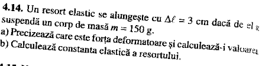
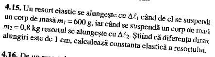

$\Delta l$ = 3 cm = 0.03 m  
m = 150 g = 0.15 kg

a)
Fd = Fe = k * $\Delta l$ = G  
g = 10 N/kg (m/$s^2$)  
G = m * g = 0.15 kg * 10 N / kg = 1.5 N  
Fd = G = 1.5 N

b)
G = k * $\Delta l$ = 1.5 N  
k = $\frac {G} {\Delta l}$ = $\frac {1.5 N} {0.03 m}$ = $\frac {0.5 N} {0.01 m}$ = 50 N / m

(ceva * m = N => ceva = N / m)

### Ipoteza (datele problemei)
$\Delta l_1$ = ?  
$m_1$ = 600 g = 0.6 kg  
$m_2$ = 0.8 kg  
$\Delta l_2$ = ?  
| $\Delta l_1$ - $\Delta l_2$ | = 1 cm

### Concluzie (se cere)
k = ?

### Rezolvare:

g = 10 N / kg

Fd = Fe = k * $\Delta l$ = G  
G = m * g

1. k * $\Delta l_1$ = $m_1$ * g
2. k * $\Delta l_2$ = $m_2$ * g

cazul 1 => k = $m_1$ * g / $\Delta l_1$  
cazul 2 => k = $m_2$ * g / $\Delta l_2$  
=> $\frac {m_1 * g} {\Delta l_1}$ = $\frac {m_2 * g} {\Delta l_2}$
=> $\frac {m_1} {\Delta l_1}$ = $\frac {m_2} {\Delta l_2}$

$m_2$ > $m_1$ => $\Delta l_2$ > $\Delta l_1$ => $\Delta l_2$ - $\Delta l_1$ = 1 cm = 0.01 m

=> $\Delta l_2$ = $\Delta l_1$ + 0.01 m

$\frac {m_1} {\Delta l_1}$ = $\frac {m_2} {\Delta l_1 + 0.01 m}$ 

$\frac {m_1} {m_2}$ = $\frac {\Delta l_1} {\Delta l_1 + 0.01 m}$ 

$\frac {m_2} {m_1}$ = $\frac {\Delta l_1 + 0.01 m} {\Delta l_1}$ 
 

$\frac {m_2} {m_1}$ = 1 + $\frac {0.01 m} {\Delta l_1}$ 

$\frac {m_2} {m_1}$ - 1 = $\frac {0.01 m} {\Delta l_1}$ 

$\Delta l_1$ = $\frac {0.01 m} {\frac {m_2} {m_1} - 1}$  

$\Delta l_1$ = $\frac {0.01 m} {\frac {0.8 kg} {0.6 kg} - 1}$  

$\Delta l_1$ = $\frac {0.01 m} {\frac {1} {3}}$ = 0.01 m * 3 = 0.03 m  
$\Delta l_1$ = 0.03 m

=> k = $\frac {m_1 * g} {\Delta l_1}$ = $\frac {0.6 kg * 10 N / kg} {0.03 m}$  
=> k = $\frac {6 N} {0.03 m}$ = $\frac {2 N} {0.01 m}$ = 200 N / m  
k = 200 N / m

