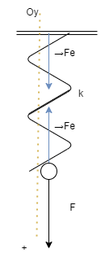

# Forta elastica [Sursa](../probleme%20recomandate/forta_elastica_fisa_de_lucru.docx)

## 1. Asupra unui resort cu constanta elastică 1000 N/m acționează o forță de 30 N. Care va fi alungirea resortului? Ce valoare are forța elastică ce apare în resort?

### Datele problemei:

- k = 1000 N/m
- F = 30 N

### Se cere:

- x = ? (raspuns)
- Fe = ? (raspuns)

### Rezolvare:

`Fe = ?`

*Fe = k * x*

Vectorial:
- Oy: →F + →Fe = →0

Scalar:
- Oy: F - Fe = 0 
- => F = Fe (F = 30 N) 
- => Fe = 30 N

`x = ?`

- *Fe = k * x*
- => x = Fe / k 
- x = 30 ~~N~~ / 1000 ~~N~~/m = 0.03 m (3 cm)

## 2.	Ce forță a acționat asupra unui resort cu k = 450 N/m dacă acesta s-a alungit cu 5 cm? Ce valoare are forța elastică ce apare în resort?

### Datele pb:

- k = 450 N/m
- x = 5 cm = 0.05 m

### Se cere:

- Fe = ?
- F = ?
(raspuns ambele)

### Rezolvare:

Din problema anterioara => F = Fe

`Fe = ?`

- *Fe = k * x*
- => Fe = 450 N/~~m~~ * 0.05 ~~m~~ 
- = 45 * 5 / 10 N = 22.5 N

## 3.	Un resort elastic se alungește cu 4 cm dacă de el se suspendă un corp de masă 160 g. Aflați:
-	Forța deformatoare
-	Constanta elastică a resortului
-	Forța elastică

### Datele pb:

- x = 4 cm = 0.04 m
- m = 160 g = 0.16 kg
- (g = 10 N / kg)

### Se cere:

- F = ? (forta care deformeaza resortul este chiar greutatea corpului)
- k = ? (raspuns)
- Fe = ? (raspuns)

### Rezolvare:

Vectorial:
- Oy: →G + →Fe = →0

Scalar:
- Oy: G - Fe = 0 => G = Fe

`k = ?`
- *G = m * g*
- *Fe = k * x*
- => m * g = k * x 
- => k = m * g / x
- => k = 0.16 ~~kg~~ * 10 (N / ~~kg~~) / (0.04 m)
- => k = 64 * 10^-3^ N / m = 0.064 N / m

`Fe = ?`
- Fe = G = m * g = 0.16 ~~kg~~ * 10 N / ~~kg~~ = 1.6 N

## *Vectori*:

- reprezentari (sageti) (in fizica - repr. ale fortelor)
- caracteristici:
    - origine
    - directie (dreapta suport)
    - sens
    - modul (lungime - valoare numerica + unitate de masura) (ex. 5 N)
        - (5 - valoarea numerica)
        - (N - unitatea de masura)